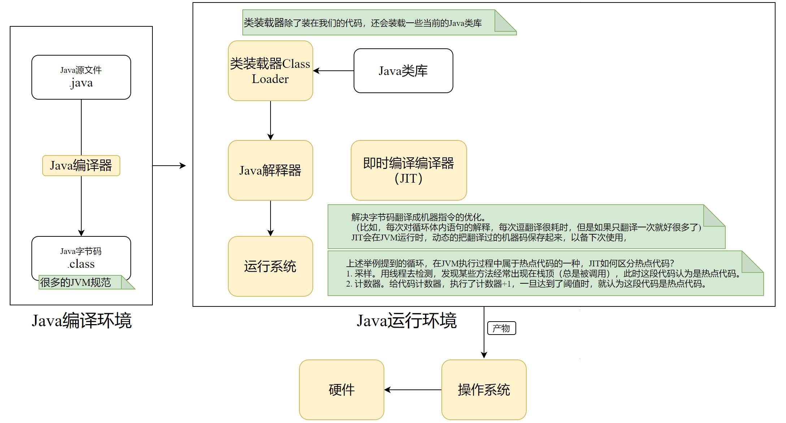

**JVM - Java Virtual Machine Java虚拟机**

**为什么要学习JVM ?**

- JVM在中高级面试中很重要；
- JVM帮助更加深入的理解Java
  - 程序如何装在知道JVM中的
  - JVM运行时如何进行存储的
  - 程序中的方法对象时如何调用的
  - 创建集合或者数组时内存是如何分配的
  - 程序运行过程中的垃圾是怎么进行回收的
- 高并发系统时的参数调整
- 遇到内存泄漏等问题时如何去排查问题

**虚拟机是什么？**

- **通过软件模拟的具有完整硬件系统功能的、运行在一个完全隔离环境中的完整计算机系统。**
- 目前流行的虚拟机软件（比如，Virtual Box）都能在Windows系统上虚拟出多个计算机，每个虚拟计算机可以独立运行，可以安装各种软件与应用等。
- **Java虚拟机也是类似的作用，所以可以实现"一次编写，到处运行"的特性。**
  - 编程语言有解释型语言和编译型语言
  - **对于解释型语言来说，**是无法被当前平台直接执行的。因为，计算机在底层运行的都是一条条指令，所以对于高级语言而言就需要中间代码，编译之后会生成目标代码。目标代码通过解释，最终翻译成基于宿主机的指令，从而进行执行。*（比如，Java程序生成字节码，字节码在JVM中加载，之后在运行过程中对字节码进行解释，最终翻译成基于宿主机的指令，从而进行执行。）*
  - **对于编译型语言来说，**是基于当前系统平台，直接进行编译，编译出来的代码只能在当前平台运行。因为，它依赖于硬件底层的汇编指令，从而只是针对当前系统执行，所以换到其他的平台就无法运行了。

**JVM的执行过程？**

**JVM的主要功能？**

- ClassLoader装载class文件；
- 解释字节码并执行；
- 运行期间的内存分配和垃圾回收；
- 提供和硬件交互的平台。